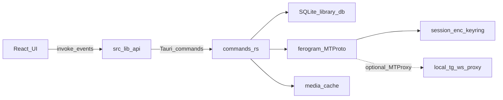

# Architecture

SoundGrammy is a local-first Tauri desktop player. The UI never talks to Telegram directly; the Rust side owns MTProto, SQLite, and media.

## Bootstrap

1. `auth_status` — **local only** (`session.enc` + SQLite profile). No MTProto. Unauthorized → login UI.
2. On authorized: hydrate session store, `list_tracks` + `list_playlists` + `list_listen_stats` → UI **ready**.
3. Background reconnect loop: `refresh_auth` with exponential backoff (and immediate retry on browser `online`); on success, `sync_saved_music`. On sync `changed`, reload library into stores.
4. Network timeouts / unreachable leave the cached library and local session as-is; sync-dot shows offline / connecting and keeps retrying.
5. Server-proven session death (`AUTH_KEY_*` / `SESSION_REVOKED`, etc.) clears local session, emits `auth:revoked`, UI returns to login.
6. Sync errors leave the cached library as-is; reconnect will retry sync after auth succeeds again.

Optional **MTProto proxy** (tg-ws-proxy compatible: server / port / secret or `tg://proxy?…`) is stored in SQLite `app_settings` and applied when building the ferogram client. Changing proxy settings rebuilds the client in-process. If a configured proxy fails at startup, the app falls back to a direct connection so the login UI can still load and the user can disable the proxy.

## Data ownership

| Data | Source of truth | Local store |
|------|-----------------|-------------|
| Saved / profile music | Telegram | SQLite tracks (synced) |
| Custom playlists | App | SQLite |
| Liked playlist | App | SQLite |
| Playback queue / UI state | App | Zustand (ephemeral session order; not restored across restart) |
| Listen statistics | App (listen behaviour) | SQLite events + aggregates ([listen-statistics.md](./listen-statistics.md)) |

**Playlist JSON recipe** (`export_playlist_json` / `analyze_playlist_json` / `import_playlist_json`): same-account cross-device sync for Liked and custom playlists. File contains ordered Telegram document ids (`file_unique_id`), optional playlist cover, and exporter `tgUserId`. Import is a prepare-then-create flow in the Create playlist dialog (analyze matches first; name can be edited). Import always creates a new custom playlist (duplicate names allowed); other-account files are rejected. Distinct from **Download playlist** (audio files + M3U under Downloads).

## Media

- **App cache**: audio under the app cache dir (`audio/{file_unique_id}.{ext}`). Used for in-app playback. Subject to Settings size limit / TTL / clear. Thumbnail border (greyish → primary) reflects cache status.
- **Download (export)**: copies a track into the system Downloads folder (`SoundGrammy/…`). Not removed by clear cache or eviction. Bulk export uses a dated subfolder.
- **Download playlist** (`download_playlist`): writes `Downloads/SoundGrammy/<playlist name>/` with audio files plus a UTF-8 `.m3u8` (relative paths). Allowed for All tracks, Liked, and custom playlists (not Popular/Recent). Sequential per-track `ensure_audio` → copy (same as single-track download); does **not** use the bulk Cache size pre-check. Partial success: failures are skipped and reported; M3U lists only files that landed. If the M3U write fails after audio copies succeed, the command still returns the per-track result (folder + succeeded/failed) so the UI can show the summary. Job progress is keyed by `jobId` so parallel playlist downloads and playlist switches keep correct UI state (`playlist-jobs-store`).
- **Cached playback path**: absolute path → `fileSrc()` (`asset:` URL) for `<audio>` / images.
- **Uncached (streamed)**: `get_track_source` returns `stream`; the UI attaches `<audio>` to a MediaSource object URL and appends bytes via `read_stream_range` as the download ledger grows (`src/hooks/audio/mse-session.ts`). Full track duration is set on the `MediaSource` from metadata. Buffer UI uses `download:progress` ranges, not WebKit's optimistic `HTMLMediaElement.buffered`.
- Completing a stream finalize marks the track cached (Telegram-like). Explicit **Cache** also fills app cache without writing to Downloads.
- The `stream:` protocol in `streaming.rs` remains as the byte backend / range fetcher; playback must not assign `stream:` directly as `audio.src` (that progressive path lies about buffer and clock under WebKit).
- See [MSE-integration.md](./MSE-integration.md) for the why and transport notes.

## Events

| Event | Meaning |
|-------|---------|
| `sync:start` / `sync:progress` / `sync:done` | Saved-music sync lifecycle |
| `auth:revoked` | Local session cleared after server-proven auth death |
| `download:progress` | Per-track download bytes / ranges |
| `download_playlist:progress` | Playlist download slot progress (`jobId` / `current` / `total` / `trackId`) |
| `cache_tracks:progress` | Bulk cache job progress when a `jobId` is provided |
| `cache:changed` | Track(s) entered/left app cache, or full clear |

Listeners live in `src/lib/api.ts`.

## Where to change what

| Concern | Start here |
|---------|------------|
| New IPC | `commands.rs` → `lib.rs` → `src/lib/api.ts` |
| Track / playlist persistence | `db.rs` |
| Telegram sync | `telegram/saved_music.rs` |
| Auth flows | `telegram/auth.rs` + login UI |
| Player UI / queue | `stores/player-store.ts`, `lib/queue/`, `components/audio/` (queue popover under `components/audio/queue/`) |
| Listen statistics | `listen_stats.rs`, `db.rs`, `hooks/audio/use-listen-tracker.ts`, `stores/listen-stats-store.ts` |
| Playlist tracklist (table, sort, selection, context menu) | `components/playlist/` (`PlaylistView`, `PlaylistTracksTable`, `track-actions`) |

## Playback queue

- Session playback order lives in `player-store` (`tracks` + `cursor` + optional playlist `source` label).
- Visible/editable via the queue control on the player (`components/audio/queue/`).
- Edits (reorder / add / remove / clear up next) clear the source label so the queue is no longer presented as the original playlist.
- Not persisted across app restart; durability is **Save as playlist** from the queue (full / from here / up next scopes).
- Play next / Add to end from track context and bulk actions insert into the session queue; whole-playlist Play still replaces it.

## Playlist boundaries

- **All tracks** (`id: all`) — virtual view of the synced library; not a DB playlist. Immutable membership (no remove-from-playlist). Track order follows Telegram sync (`track_position`); not drag-reorderable.
- **Liked** (`id: liked`) — app-owned; membership via `toggle_like` only (not `add_track_to_playlist` / remove-from-playlist UI). Unique membership. Custom order persisted with `reorder_playlist_tracks`.
- **Popular** (`id: popular`) / **Recent** (`id: recent`) — virtual smart playlists from listen stats ∩ library. Ordered by likeness / last played. Immutable membership; not drag-reorderable.
- **Custom playlists** — editable membership; the same track may appear more than once as distinct ordered entries. Context menu and bulk actions may show “Remove from playlist” (removes one occurrence by position). Track order persisted with `reorder_playlist_tracks`.

Tracklist actions are gated in `src/components/playlist/track-actions.ts` so non-custom playlists never expose remove-from-playlist. Drag-reorder is enabled only for Liked/custom when search and column sort are clear and selection mode is off.
