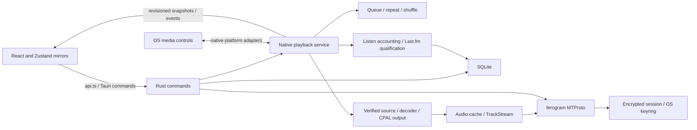

# Architecture

SoundGrammy is a local-first Tauri music player with a React interface and a process-owned Rust playback service. Desktop releases are supported; Android and iOS playback integration is implemented but still requires mobile build/device validation as described in [mobile background playback](mobile-background-playback.md). The UI never talks to Telegram directly; Rust owns MTProto, SQLite, decoding, queue policy, and listening accounting.

## Bootstrap

1. `auth_status` — **local only** (`session.enc` + SQLite profile). No MTProto. Unauthorized → login UI.
2. On authorized: hydrate session store, `list_tracks` + `list_playlists` + `list_listen_stats` → UI **ready**.
3. Background reconnect loop: `refresh_auth` with exponential backoff (and immediate retry on browser `online`); on success, `sync_saved_music`. On sync `changed`, reload library into stores.
4. Network timeouts / unreachable leave the cached library and local session as-is; sync-dot shows offline / connecting and keeps retrying.
5. Server-proven session death (`AUTH_KEY_*` / `SESSION_REVOKED`, etc.) clears local session, emits `auth:revoked`, UI returns to login.
6. Sync errors leave the cached library as-is; reconnect will retry sync after auth succeeds again.

Optional **MTProto proxy** (tg-ws-proxy compatible: server / port / secret or `tg://proxy?…`) is stored in SQLite `app_settings` and applied when building the ferogram client. Changing proxy settings rebuilds the client in-process. If a configured proxy fails at startup, the app falls back to a direct connection so the login UI can still load and the user can disable the proxy.

The UI reconnect loop refreshes library/auth presentation. Playback-critical downloads have native retry and connection recovery; background playback does not depend on browser connectivity events. See [streaming](streaming.md).

## Data ownership

| Data | Source of truth | Local store |
|------|-----------------|-------------|
| Saved / profile music | Telegram | SQLite tracks (synced) |
| Custom playlists | App | SQLite |
| Liked playlist | App | SQLite |
| Playback queue / transport | Rust audio session | Native in-memory queue; Zustand mirrors snapshots (not restored across restart) |
| Repeat/shuffle preferences | Rust audio session | SQLite `playback_preferences` |
| App gain / mute controls | Frontend preference, applied to native output | localStorage; reapplied on UI attachment |
| Listen statistics | App (listen behaviour) | SQLite events + aggregates ([listen-statistics.md](./listen-statistics.md)) |
| Last.fm account | Last.fm | Session key in OS keyring; username/settings in SQLite |
| Pending Last.fm scrobbles | App (qualified playback attempts) | SQLite immutable queue |

**Playlist JSON recipe** (`export_playlist_json` / `analyze_playlist_json` / `import_playlist_json`): same-account cross-device sync for Liked and custom playlists. File contains ordered Telegram document ids (`file_unique_id`) and exporter `tgUserId`. Import is a prepare-then-create flow in the Create playlist dialog (analyze matches first; name can be edited). Import always creates a new custom playlist (duplicate names allowed); other-account files are rejected. Distinct from **Download playlist** (audio files + M3U under Downloads).

## Media

- **App cache**: audio under the app cache dir (`audio/{file_unique_id}.{ext}`). Used for in-app playback. Subject to Settings size limit / TTL / clear. Thumbnail border (greyish → primary) reflects cache status.
- **Download (export)**: copies a track into the system Downloads folder (`SoundGrammy/…`). Not removed by clear cache or eviction. Bulk export uses a dated subfolder.
- **Download playlist** (`download_playlist`): writes `Downloads/SoundGrammy/<playlist name>/` with audio files plus a UTF-8 `.m3u8` (relative paths). Allowed for All tracks, Liked, and custom playlists (not Popular/Recent). Sequential per-track `ensure_audio` → copy (same as single-track download); does **not** use the bulk Cache size pre-check. Partial success: failures are skipped and reported; M3U lists only files that landed. If the M3U write fails after audio copies succeed, the command still returns the per-track result (folder + succeeded/failed) so the UI can show the summary. Job progress is keyed by `jobId` so parallel playlist downloads and playlist switches keep correct UI state (`playlist-jobs-store`).
- **Cached playback path**: Rust opens the local audio file directly. Images continue using `fileSrc()` (`asset:` URLs).
- **Uncached (streamed)**: the Rust audio source reads verified byte ranges from `TrackStream`. Symphonia decodes audio and CPAL sends PCM to the output device. No audio bytes cross frontend IPC.
- The native engine publishes presentation time and timestamp-mapped downloaded ranges to the UI. Missing bytes remain unavailable until the downloader verifies them.
- Completing a stream marks the track cached. Explicit **Cache** also fills app cache without writing to Downloads.
- See [native audio](./native-audio.md) and [streaming](./streaming.md) for playback and download lifetimes.

## Events

| Event | Meaning |
|-------|---------|
| `sync:start` / `sync:progress` / `sync:done` | Saved-music sync lifecycle |
| `auth:revoked` | Local session cleared after server-proven auth death |
| `download:progress` | Per-track download bytes / ranges |
| `download_playlist:progress` | Playlist download slot progress (`jobId` / `current` / `total` / `trackId`) |
| `cache_tracks:progress` | Bulk cache job progress when a `jobId` is provided |
| `cache:changed` | Track(s) entered/left app cache, or full clear |
| `audio:state` | Native transport snapshot; session state included on queue/policy changes |
| `audio:event` | Natural completion notification; progression already belongs to Rust |
| `listen:stats` | Native listen aggregate update |
| `lastfm:status_changed` | Safe account/auth/queue status changed |

Listeners live in `src/lib/api.ts`.

## Where to change what

| Concern | Start here |
|---------|------------|
| New IPC | `commands.rs` → `lib.rs` → `src/lib/api.ts` |
| Track / playlist persistence | `db.rs` |
| Telegram sync | `telegram/saved_music.rs` |
| Auth flows | `telegram/auth.rs` + login UI |
| Native queue / playback policy | `src-tauri/src/audio/session.rs`, `audio/shuffle.rs`, `audio/mod.rs` |
| Player UI / queue mirror | `src/stores/player-store.ts`, `src/components/audio/`, `src/hooks/audio/native-engine.ts` |
| OS controls / mobile lifecycle | `src-tauri/src/audio/media/`, `audio/lifecycle.rs`, `audio/ios.rs`, Android `PlaybackService.kt` |
| Listen statistics | `listen_stats.rs`, `db.rs`, `audio/activity.rs`, `stores/listen-stats-store.ts` |
| Playlist tracklist (table, sort, selection, context menu) | `components/playlist/` (`PlaylistView`, `PlaylistTracksTable`, `track-actions`) |

## Playback queue

- Session playback order lives in Rust `audio/session.rs` (`tracks`, cursor, source, and base order). `player-store` mirrors acknowledged native snapshots; queue actions send commands to Rust.
- Visible/editable via the queue control on the player (`components/audio/queue/`).
- Edits (reorder / add / remove / clear up next) clear the source label so the queue is no longer presented as the original playlist.
- Survives UI suspension/recreation while the native process remains alive. Queue/cursor/position are not restored after process termination; a fresh process starts idle. **Save as playlist** preserves track order, not a playback checkpoint (full / from here / up next scopes).
- Play next / Add to end from track context and bulk actions insert into the session queue; whole-playlist Play still replaces it.

## Playlist boundaries

- **All tracks** (`id: all`) — virtual view of the synced library; not a DB playlist. Immutable membership (no remove-from-playlist). Track order follows Telegram sync (`track_position`); not drag-reorderable.
- **Liked** (`id: liked`) — app-owned; membership via `toggle_like` only (not `add_track_to_playlist` / remove-from-playlist UI). Unique membership. Custom order persisted with `reorder_playlist_tracks`.
- **Popular** (`id: popular`) / **Recent** (`id: recent`) — virtual smart playlists from listen stats ∩ library. Ordered by likeness / last played. Immutable membership; not drag-reorderable.
- **Custom playlists** — editable membership; the same track may appear more than once as distinct ordered entries. Context menu and bulk actions may show “Remove from playlist” (removes one occurrence by position). Track order persisted with `reorder_playlist_tracks`.

Tracklist actions are gated in `src/components/playlist/track-actions.ts` so non-custom playlists never expose remove-from-playlist. Drag-reorder is enabled only for Liked/custom when search and column sort are clear and selection mode is off.

See [Audio engine boundary](audio-engine.md) for transport ownership, implementation selection, and the native proxy contract.

## OS media controls

The [native media bridge](./native-media-bridge.md) publishes Rust playback state to macOS/iOS MediaPlayer, Windows SMTC, Linux MPRIS, and Android MediaSession. Native callbacks share the Rust command queue with UI actions and continue across WebView reloads.

## Playback lifetime and persistence

Backgrounding, UI recreation, and process termination are different boundaries:

| Boundary | Current behavior |
| --- | --- |
| React unmount or WebView reload | Detach subscriptions and invalidate old UI commands; native playback continues |
| UI returns in the same process | Fetch revisioned transport/session snapshots and listen aggregates; do not start another attempt |
| Mobile background / screen lock | Android foreground service or iOS audio session supports native playback; device acceptance remains outstanding |
| Explicit exit, OS process death, or force-stop | In-memory queue, position, and active attempt are lost; next launch starts idle |
| Logout / revoked Telegram session | Explicitly clear the playback session and OS metadata |

SQLite retains the library, playlists, repeat/shuffle preferences, recorded listen history,
and already-queued Last.fm scrobbles. An unfinished listen attempt is not a durable
checkpoint and may be lost on abrupt termination. Persistent Telegram authentication
is separate from the in-memory playback session.

Queue/position restoration is not implemented. Adding it would require durable queue
membership/order and cursor, position checkpoints, validation against the current
library/account, and an explicit policy for incomplete listen attempts. Restoring the
UI in a paused state would allow an explicit Play action without automatically starting
audio on launch. Such restoration cannot keep audio running while the process is dead.
