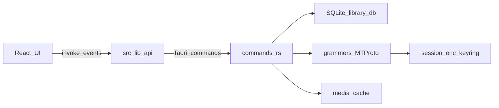

# Architecture

SoundGrammy is a local-first Tauri desktop player. The UI never talks to Telegram directly; the Rust side owns MTProto, SQLite, and media.

## Bootstrap

1. `auth_status` — if unauthorized → login UI (phone or QR).
2. On authorized: hydrate session store, `list_tracks` + `list_playlists`.
3. Background `sync_saved_music`; on `changed`, reload library into stores.
4. Sync errors leave the cached library as-is.

## Data ownership

| Data | Source of truth | Local store |
|------|-----------------|-------------|
| Saved / profile music | Telegram | SQLite tracks (synced) |
| Custom playlists | App | SQLite |
| Liked playlist | App | SQLite |
| Playback queue / UI state | App | Zustand (ephemeral session order; not restored across restart) |
| Listen statistics | App (listen behaviour) | SQLite events + aggregates ([listen-statistics.md](./listen-statistics.md)) |

## Media

- **Cached**: absolute path → `fileSrc()` (`asset:` URL) for `<audio>` / images.
- **Uncached (streamed)**: `get_track_source` returns `stream`; the UI attaches `<audio>` to a `MediaSource` object URL and appends bytes via `read_stream_range` as the download ledger grows (`src/hooks/audio/mse-session.ts`). Full track duration is set on the `MediaSource` from metadata. Buffer UI uses `download:progress` ranges, not WebKit’s optimistic `HTMLMediaElement.buffered`.
- The `stream:` protocol in `streaming.rs` remains as the byte backend / range fetcher; playback must not assign `stream:` directly as `audio.src` (that progressive path lies about buffer and clock under WebKit).
- Downloads / prefetch write into the app cache dir; progress via `download:progress`.
- See [MSE-integration.md](./MSE-integration.md) for the why and transport notes.

## Events

| Event | Meaning |
|-------|---------|
| `sync:start` / `sync:progress` / `sync:done` | Saved-music sync lifecycle |
| `download:progress` | Per-track download bytes / ranges |

Listeners live in `src/lib/api.ts`.

## Where to change what

| Concern | Start here |
|---------|------------|
| New IPC | `commands.rs` → `lib.rs` → `src/lib/api.ts` |
| Track / playlist persistence | `db.rs` |
| Telegram sync | `telegram/saved_music.rs` |
| Auth flows | `telegram/auth.rs` + login UI |
| Player UI / queue | `stores/player-store.ts`, `lib/queue/`, `components/audio/` (queue popover under `components/audio/queue/`) |
| Listen statistics | `listen_stats.rs`, `db.rs`, `hooks/audio/use-listen-tracker.ts` |
| Playlist tracklist (table, sort, selection, context menu) | `components/playlist/` (`PlaylistView`, `PlaylistTracksTable`, `track-actions`) |

## Playback queue

- Session playback order lives in `player-store` (`tracks` + `cursor` + optional playlist `source` label).
- Visible/editable via the queue control on the player (`components/audio/queue/`).
- Edits (reorder / add / remove / clear up next) clear the source label so the queue is no longer presented as the original playlist.
- Not persisted across app restart; durability is **Save as playlist** from the queue (full / from here / up next scopes).
- Play next / Add to end from track context and bulk actions insert into the session queue; whole-playlist Play still replaces it.

## Playlist boundaries

- **All tracks** (`id: all`) — virtual view of the synced library; not a DB playlist. Immutable membership (no remove-from-playlist). Track order follows Telegram sync (`track_position`); not drag-reorderable.
- **Liked** (`id: liked`) — app-owned; membership via `toggle_like` only (not `add_track_to_playlist` / remove-from-playlist UI). Unique membership. Custom order persisted with `reorder_playlist_tracks`.
- **Custom playlists** — editable membership; the same track may appear more than once as distinct ordered entries. Context menu and bulk actions may show “Remove from playlist” (removes one occurrence by position). Track order persisted with `reorder_playlist_tracks`.

Tracklist actions are gated in `src/components/playlist/track-actions.ts` so All tracks / Liked never expose remove-from-playlist. Drag-reorder is enabled only when search and column sort are clear and selection mode is off.
