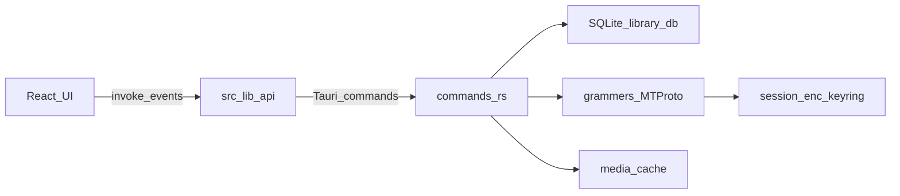

# Architecture

SoundGrammy is a local-first Tauri desktop player. The UI never talks to Telegram directly; the Rust side owns MTProto, SQLite, and media.

## Bootstrap

1. `auth_status` — if unauthorized → login UI (phone or QR).
2. On authorized: hydrate session store, `list_tracks` + `list_playlists`.
3. Background `sync_saved_music`; on `changed`, reload library into stores.
4. Sync errors leave the cached library as-is.

## Data ownership

| Data | Source of truth | Local store |
|------|-----------------|-------------|
| Saved / profile music | Telegram | SQLite tracks (synced) |
| Custom playlists | App | SQLite |
| Liked playlist | App | SQLite |
| Playback queue / UI state | App | Zustand (ephemeral) |

## Media

- **Cached**: absolute path → `fileSrc()` (`asset:` URL) for `<audio>` / images.
- **Uncached**: `get_track_source` may return `stream`; UI uses `streamSrc(trackId)` (`stream:` protocol in `lib.rs` / `streaming.rs`).
- Downloads / prefetch write into the app cache dir; progress via `download:progress`.

## Events

| Event | Meaning |
|-------|---------|
| `sync:start` / `sync:progress` / `sync:done` | Saved-music sync lifecycle |
| `download:progress` | Per-track download bytes / ranges |

Listeners live in `src/lib/api.ts`.

## Where to change what

| Concern | Start here |
|---------|------------|
| New IPC | `commands.rs` → `lib.rs` → `src/lib/api.ts` |
| Track / playlist persistence | `db.rs` |
| Telegram sync | `telegram/saved_music.rs` |
| Auth flows | `telegram/auth.rs` + login UI |
| Player UI / queue | `stores/player-store.ts`, `components/audio/` |
